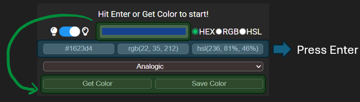
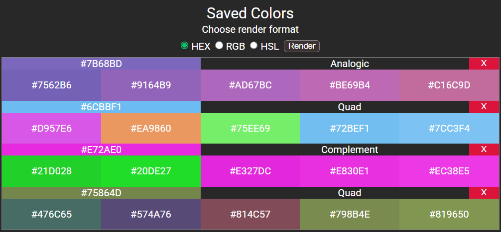
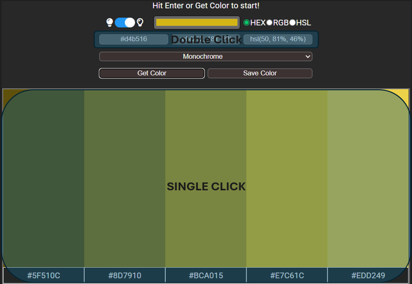
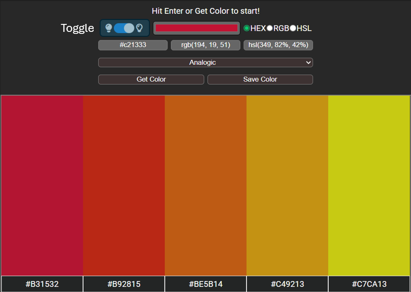
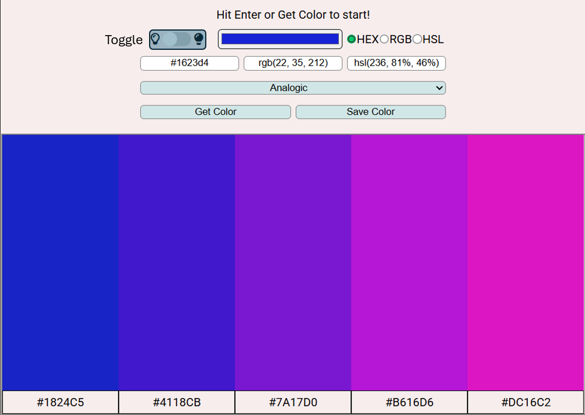
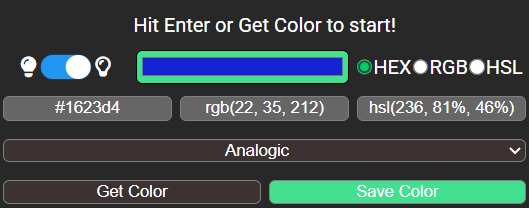

# A color-palette generator
An extension (or an webpage) that is built upon the [colorAPI](https://www.thecolorapi.com/), allowing you to generate, save and copy color palettes with ease.

    

## Get Started
* Access it as a webpage here: [A color-palette generator](https://adorable-bavarois-f53df2.netlify.app/)

* Access it as a chrome extension
    1. `git clone` this repo.
    2. Go to [chrome://extensions](chrome://extensions)
    3. Turn on Developer Mode
    4. Load Unpacked
    5. Locate and select the `dist` folder from the cloned repo.

## Features / Implementations

* Generate color palette based on a base color and a color mode. The color paletter's color code will be rendered in the provided color format (in HEX, RGB or HSL).
    - The base color can be provided in 2 ways:
        - Using the color picker (Fetch the color palette by ***clicking the 'Get Color' button***)
        - Manually typing in the color code in HEX, RGB or HSL format (Fetch the color by ***hitting the ENTER key***)
    - The color mode can be selected from a drop down menu consisting of 'monochrome', 'monochrome-dark', 'monochrome-light', 'analogic', 'complement','analogic-complement', 'triad', 'quad'. 
        - For more details, it can be referred to this [visual summary](https://www.worqx.com/color/combinations.htm).

    

* Save the generated color palette along its base color with the color mode.
    - It is saved by ***clicking the 'Save Color' button***.
    - The color will be saved into the Local Storage.
    - The color code can be rendered in HEX, RGB or HSL format by using the radio menu in the saved color section and ***clicking the 'Render' button***
    - The saved color can be deleted by ***Double clicking the red 'X' button***.

    

* Copy Color Code
    - The generated color code for both the generated and saved color palette can be copied to clipboard directly by ***clicking anywhere in the container of that color***.
    - The text input area for the HEX, RGB and HSL can also be copied by ***double clicking the text input area***.

    

* Dark Mode
    - The webpage will first be rendered in either light or dark mode according to the user's system preference.
    - The 2 modes can then be toggled using the slider.

    
    

* The 'Get Color' and 'Save Color' buttons always generate color palette by referring to the color picker.
    - Therefore, if a text input is typed and the 'Get Color' or 'Save Color' button is clicked instead of hitting 'Enter' key, the generated color palette is based on the color picker.
    - To remind the user of this, when these 2 buttons are hovered, the buttons and the color pickers will be lit with a green background color.

    

